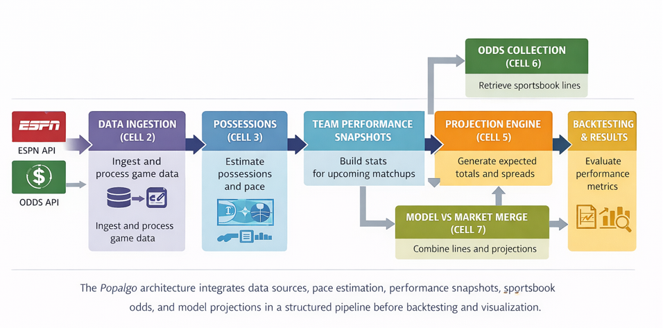
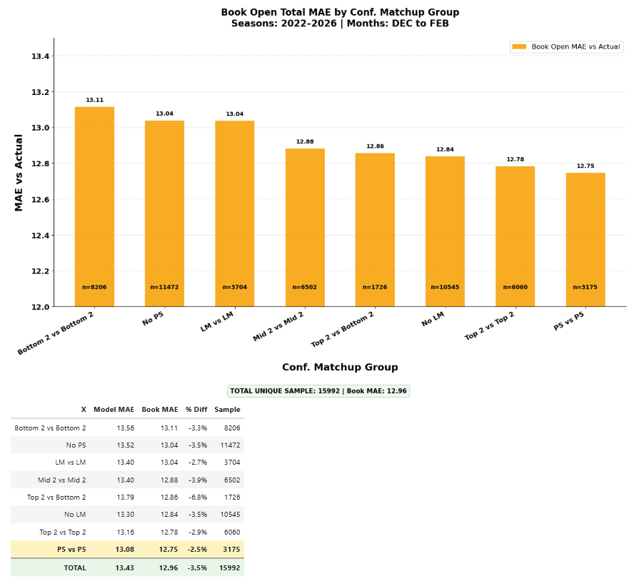
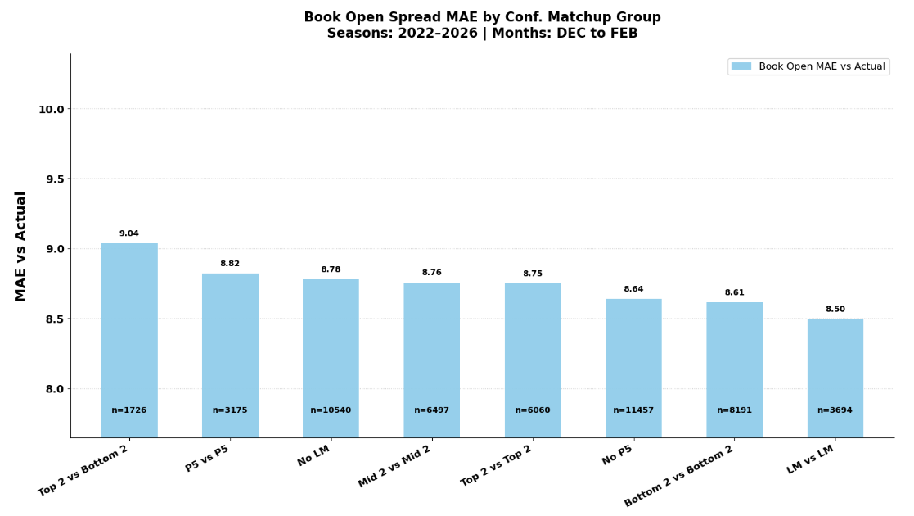
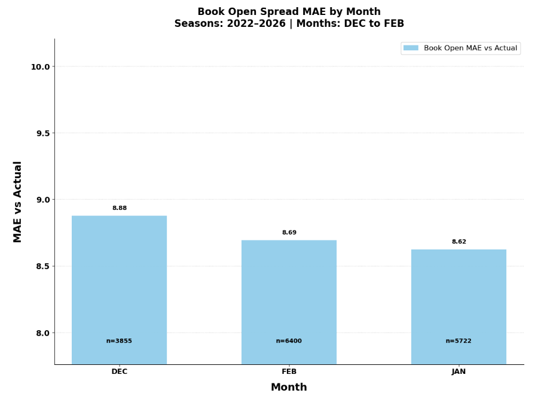
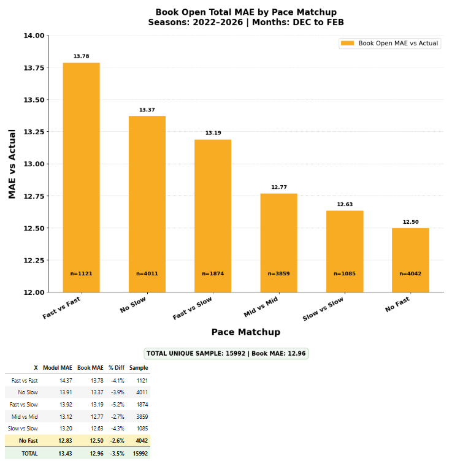
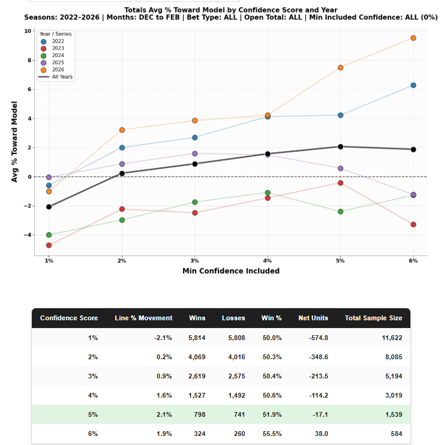
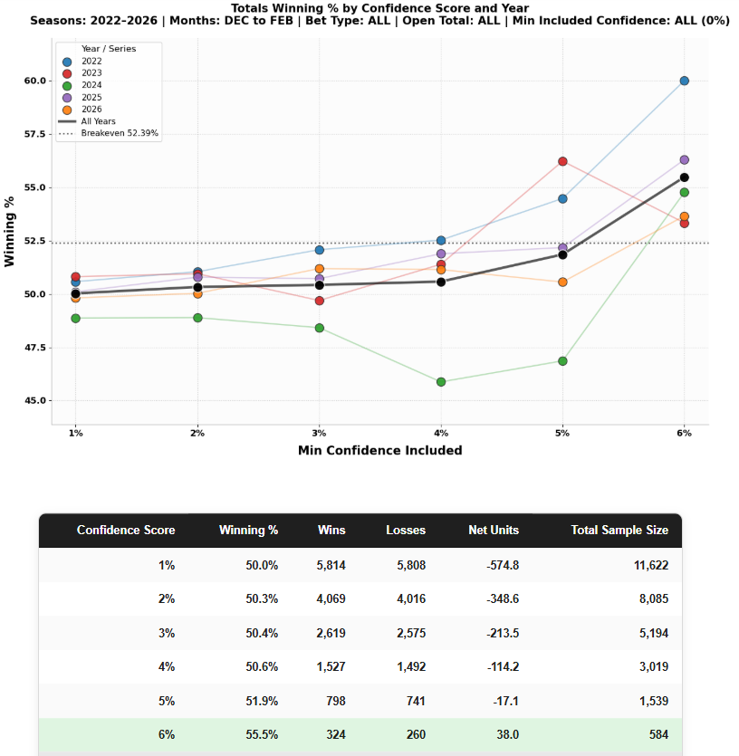
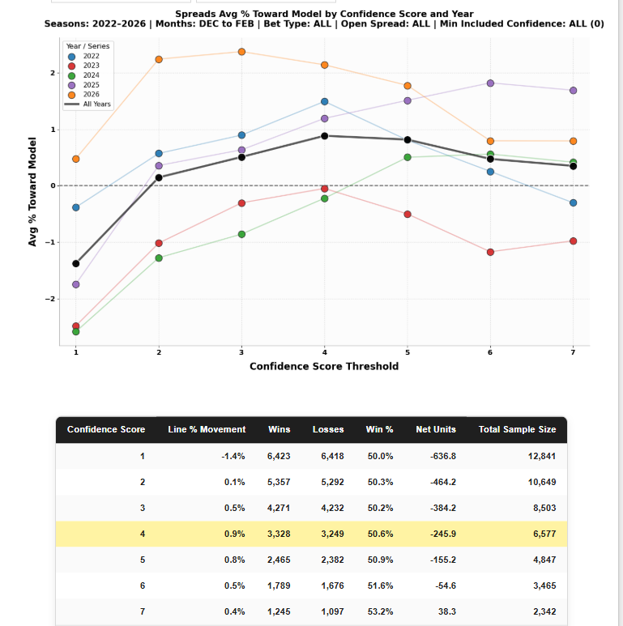
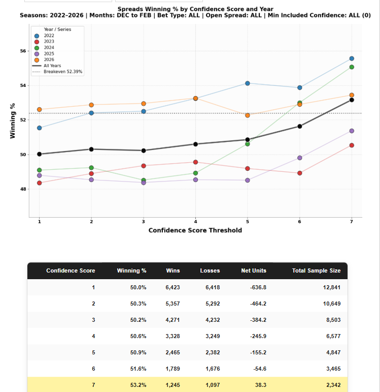

# Popalgo: College Basketball Market Inefficiency Analysis

## Project Overview

This project analyzes whether inefficiencies exist in the betting markets for **Division I college basketball** and whether a predictive model can be built to capitalize on those inefficiencies.

The analysis focuses on both **totals** and **spreads**, with particular attention paid to:

- different pace-of-play combinations  
- differences between higher-tier and lower-tier matchups  
- situations where model projections differ from sportsbook lines  
- betting market movement relative to the model  

The goal is to determine whether certain game environments create repeatable edges in the college basketball betting market.

---

## Research Questions

This project investigates the following questions:

1. Are there inefficiencies in the **college basketball totals market**?
2. Are there inefficiencies in the **college basketball spreads market**?
3. Can a predictive model identify games where sportsbook lines may be mispriced?
4. Are inefficiencies stronger in certain subsets of games such as pace matchups or tiered conference matchups?

---

## Study Period

The analysis includes **regular season games from the 2022 through 2026 seasons**, focusing primarily on the months **December through February**.

Games outside this window introduce structural differences such as:

- neutral-court environments
- unusual matchup distributions
- higher betting volume and improved market efficiency during postseason play

For these reasons, the analysis focuses on **regular season games between December and February**.

---

## Data Sources

### Game Results and Statistics

Game results, schedules, scores, and team statistics were retrieved using the **ESPN API**.

### Historical Betting Odds

Historical sportsbook totals and spreads were retrieved using **The Odds API**, including both opening and closing lines.

All data collection and cleaning were performed entirely within **Python**.

---

## Model Workflow

The predictive model follows a structured workflow:

### 1. Data Collection

Game data is collected from the ESPN API and sportsbook odds are collected from The Odds API.

### 2. Data Cleaning

Datasets are merged and standardized using **Python and Pandas**.

### 3. Feature Engineering

Key model inputs include:

- expected possessions (pace)
- offensive efficiency
- defensive efficiency
- conference tier groupings
- pace matchup combinations

### 4. Model Projection

The model estimates:

- expected total points
- expected point spreads

These projections are compared against sportsbook lines.

### 5. Evaluation

Model performance is evaluated using:

- win percentage
- net betting units
- line movement toward or away from the model
- subset analysis across matchup types

---

# System Architecture

The Popalgo framework follows a structured pipeline that integrates game data, pace estimation, team performance snapshots, sportsbook odds, and model projections before producing final backtesting results and visualizations.

The diagram below illustrates how data flows through the system from raw data sources to final evaluation metrics.

# Data Pipeline

This project uses a structured **seven-stage data pipeline** to collect, clean, transform, and combine game data with sportsbook odds before analysis.

Each stage is implemented as a separate cell within the Jupyter Notebook to maintain clarity and reproducibility.

All data cleaning and transformation is performed **entirely in Python**, satisfying the project requirement that external tools such as Excel are not used.

---

# Pipeline Overview

## Cell 1 — Environment and Project Setup

Cell 1 initializes the environment and establishes the core configuration used throughout the pipeline.

Key responsibilities include:

- loading environment variables including the **Odds API key**
- defining global parameters such as:
  - season year
  - lookback window
  - backtest start and end dates
- enforcing strict backtesting rules to prevent future data leakage
- defining API endpoints for:
  - ESPN game data
  - Odds API betting markets
- creating project directories and cache folders
- implementing helper utilities including:
  - date formatting
  - logging
  - HTTP request retry logic

---

## Cell 2 — Master Game Data Ingestion

Cell 2 builds and maintains the **season-long master dataset of completed games**.

Key steps include:

- retrieving game schedules and results from the **ESPN API**
- converting each game into **two rows** (one per team)
- recording team IDs, opponent IDs, home/away status, and scores
- filtering out incomplete games
- removing duplicate rows
- saving the dataset as a **season-level parquet file**

This dataset becomes the foundation for **all historical feature calculations**.

---

## Cell 3 — Possessions and Pace Standardization

Cell 3 standardizes possession estimates for each team-game observation.

Tasks include:

- validating existing possession values
- calculating possessions from box score statistics
- applying proxy pace estimates when data is missing
- enforcing realistic pace bounds
- tagging each row with a **possession source classification**

Possible sources include:

- **given**
- **boxscore**
- **proxy**
- **unknown**

Audit summaries are generated to verify possession reliability.

---

## Cell 4 — Daily Slate Feature Builder

Cell 4 constructs the **daily slate dataset** used by the predictive model.

This stage builds **team performance snapshots** using only information available **before each game**.

Snapshots include metrics such as:

- pace
- offensive efficiency
- defensive efficiency
- recent performance windows

These snapshots represent the model's understanding of team strength entering the game.

---

## Cell 5 — Model Projection Builder (EVA Daily)

Cell 5 generates game-level projections used to evaluate sportsbook lines.

Key calculations include:

- blended team pace estimates
- matchup-specific pace adjustments
- offensive and defensive efficiency blending
- expected possessions
- projected scores
- projected totals
- projected spreads

The output is the **EVA Daily dataset** containing model projections.

---

## Cell 6 — Sportsbook Odds Collection

Cell 6 retrieves sportsbook betting lines using **The Odds API**.

The process includes:

- mapping ESPN team names to Odds API team names
- matching games using deterministic matchup keys
- retrieving historical betting lines

Two market prices are recorded:

**Opening Line**

Earliest available line approximately:
- 12 hours before tip
- 6 hours before tip
- 3 hours before tip

**Closing Line**

Defined as the line **five minutes before tip-off**.

Odds data is cached locally to reduce repeated API requests.

---

## Cell 7 — Final Dataset Construction

Cell 7 merges projections with sportsbook odds to produce the **final analytical dataset**.

Steps include:

1. ensuring projections exist
2. ensuring sportsbook odds exist
3. merging using **event_id**

Additional processing:

- attaching final game scores
- calculating actual totals
- tagging missing projections or odds
- enforcing a consistent schema

---

## Cell 8 — Results Construction

This stage produces the final analysis-ready dataset.

It calculates:

- projected totals and spreads
- model confidence scores
- betting direction
- line movement
- game results
- pace matchup groups
- conference tier groups

The dataset is exported as a CSV for visualization and analysis.

---

# Avoiding Data Leakage in Backtesting

Preventing **data leakage** is critical in predictive modeling.

Data leakage occurs when a model accidentally uses information that would **not have been available at the time predictions were made**, resulting in unrealistic performance.

To prevent this, the project enforces strict rules:

- all features are calculated using data available **on or before the AS_OF_DATE**
- no future games are included in model inputs
- projections are generated before results are known

This ensures model evaluation reflects **real-world predictive performance**.

---

## Model Evaluation

Model projections are compared against both **sportsbook lines and actual outcomes**.

Evaluation focuses on identifying situations where sportsbook lines may be **systematically mispriced**.

### Projection Error Analysis

Comparisons include:

- model total vs actual total
- model spread vs actual margin
- sportsbook total vs actual total
- sportsbook spread vs actual margin

Metrics used:

- Mean Absolute Error (MAE)
- Mean Squared Error (MSE)
- average bias

---

### Market Comparison

For each game, the **model edge** is calculated:

- model projected total vs sportsbook total
- model projected spread vs sportsbook spread

Large edges represent strong disagreement between the model and the market.

---

### Line Movement Analysis

The analysis also tracks how betting lines move between **open and close**.

Measurements include:

- percentage of games where the market moves toward the model
- percentage where it moves away from the model

---

### Subset Performance Analysis

Results are also analyzed across subsets including:

- pace-of-play matchups
- conference tier matchups
- confidence thresholds
- season segments

This helps determine whether inefficiencies are concentrated in specific environments.

---

---

# Key Visualizations and Findings

The following visualizations summarize the key findings from the analysis. These charts evaluate both **sportsbook prediction accuracy** and **model performance** across multiple dimensions including conference tiers, pace matchups, season timing, and model confidence thresholds.

---

# Sportsbook Market Accuracy

## Totals Prediction Error by Conference Matchup

This chart examines the accuracy of sportsbook opening totals across different **conference-tier matchups** using Mean Absolute Error (MAE).

MAE measures the average difference between the sportsbook’s projected total and the actual total scored in the game.

Lower values indicate more accurate predictions.

Over the past five seasons (2022–2026), a clear pattern emerges: sportsbooks tend to predict totals **more accurately in high-tier matchups** than in lower-tier games.

For example:

- **Bottom 2 vs Bottom 2 matchups** have an MAE of approximately **13.11 points** across more than **8,000 games**.
- **Power Five vs Power Five matchups** have a lower MAE of roughly **12.75 points** across over **3,000 games**.

This suggests that sportsbooks have **greater difficulty predicting scoring environments in lower-tier games**, possibly due to less statistical coverage, lower betting volume, and greater variability in pace and efficiency.

These environments therefore represent potential areas where predictive models may be able to identify useful signals.

---

## Spread Prediction Error by Conference Matchup

This chart evaluates sportsbook accuracy for **point spreads** across the same conference-tier matchups.

In contrast to totals, spreads display a somewhat **opposite pattern**.

Lower-tier matchups tend to produce **slightly lower prediction error**, while mismatched conference tiers often show higher error.

For example:

- **LM vs LM matchups** show the lowest MAE at approximately **8.50 points**.
- **Top 2 vs Bottom 2 matchups** produce the highest MAE at roughly **9.04 points**.

This difference may reflect the fact that spreads rely more heavily on **relative team strength**, which may be easier for sportsbooks to estimate even when overall scoring environments are uncertain.

Totals, on the other hand, depend more heavily on **pace of play and scoring efficiency**, which can be more volatile across lower-tier teams.

---

## Spread Prediction Accuracy Over the Season

This chart examines how sportsbook spread accuracy changes throughout the season.

Across the five-year sample, spreads become **more accurate as the season progresses**.

For example:

- **December** spreads have an MAE of approximately **8.88 points**.
- **January** improves to roughly **8.62 points**.
- **February** sits between the two at around **8.69 points**.

This trend is consistent with the idea that sportsbooks improve their estimates as **more information becomes available throughout the season**, including team performance data, roster stability, and updated power ratings.

Early-season games therefore tend to have **greater uncertainty**, while later-season lines benefit from a larger sample of team data.

---

## Totals Prediction Error by Pace Matchup

Because pace of play strongly influences scoring outcomes in basketball, totals were also evaluated across **pace matchup combinations**.

Games involving **similar pace teams** tend to be more predictable, while mismatched pace styles can produce greater uncertainty in final scoring outcomes.

This supports the underlying premise of the Popalgo framework: that **pace estimation is a critical component of predicting scoring environments in college basketball**.

---

# Model Validation

Identifying sportsbook prediction errors alone does not necessarily imply a profitable opportunity.

A key question is whether a predictive model can **systematically identify and exploit those inefficiencies**.

To evaluate this, the Popalgo model assigns a **confidence score** based on the difference between the model’s projected line and the sportsbook opening line.

Higher confidence thresholds represent **larger discrepancies between the model and the market**.

Two validation tests are used:

1. **Line movement toward the model**
2. **Historical backtested win percentage**

If the model is identifying useful information, both metrics should improve as confidence increases.

---

# Totals Model Results

## Line Movement Toward Model (Totals)

This chart measures the percentage of sportsbook line movement that occurs **in the same direction as the model’s projection**.

If the model is identifying meaningful signals, the market should tend to move toward the model after the opening line is posted.

Across the five-year sample, line movement becomes increasingly positive as the model's confidence threshold rises.

This suggests that the model is often identifying information that the betting market incorporates later.

---

## Backtested Winning Percentage (Totals)

This chart shows the historical win percentage of the model when backtested under strict **data leakage prevention** rules.

The dashed line represents the **sportsbook break-even threshold** of approximately **52.4%**, accounting for typical betting market vig.

At lower confidence thresholds, results are close to random.

However, as confidence increases:

- Win percentage improves
- Net units improve
- Sample size decreases (as expected for stronger signals)

At the **highest confidence level**, the model achieves a win rate of approximately **55.5%**, indicating that stronger model signals correspond to improved performance.

---

# Spreads Model Results

## Line Movement Toward Model (Spreads)

The same validation test can be applied to point spreads.

As the model’s confidence increases, sportsbook lines also tend to move more frequently **toward the model’s projected spread**.

Although the effect is smaller than for totals, the positive relationship between confidence and line movement suggests that the model is identifying useful information in spread pricing as well.

---

## Backtested Winning Percentage (Spreads)

Finally, the historical win percentage of the model for spreads is evaluated across confidence thresholds.

As with totals, higher confidence thresholds produce improved performance.

At the highest threshold:

- Win percentage rises to approximately **53.2%**
- Across more than **2,300 games**

While spreads appear to be a more efficient market overall, the upward trend suggests that the model’s confidence score is still able to identify **higher-quality signals within the dataset**.

---

---

# Next Steps

While the current analysis focuses on Division I college basketball totals and spreads, the broader framework is designed to be flexible and extensible.

Future development of the Popalgo framework will focus on the following areas:

### Expand to Additional Sports and Markets

The core pipeline and modeling structure can be adapted to other sports or betting markets where pace, efficiency, and scoring environments play a meaningful role.

Potential applications include:

- NBA
- NHL
- NFL totals
- Other niche betting markets

---

### Improve Model Inputs

The predictive model can be enhanced by continuing to incorporate additional variables and refinements, such as:

- expanded team efficiency metrics
- lineup or roster adjustments
- situational variables
- improved pace estimation techniques

Continued tracking and evaluation of these variables will help refine model accuracy over time.

---

### Use the Framework as a Template for Future Models

Beyond sports betting, the Popalgo pipeline serves as a **general template for building predictive models**.

The structured workflow — including data ingestion, feature construction, projection generation, market comparison, and backtesting — provides a reusable framework for developing predictive systems in other domains.

This architecture can serve as a starting point for future modeling projects across a wide range of applications.

## Author

DJ Barry